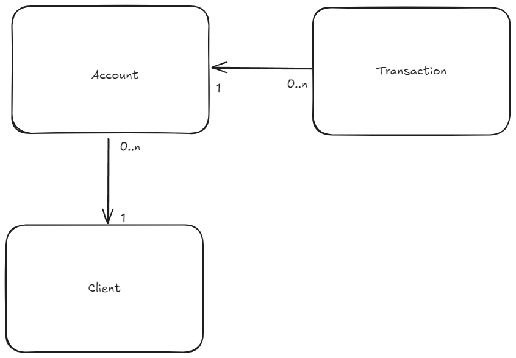

| Client       | Transaction         | Account         |
|--------------|---------------------|-----------------|
| id_user (PK) | id_transaction (PK) | id_account (PK) |
| cpf          | id_account (FK)     | id_user (FK)    |
| name         | amount              | account_type    |
| email        | transaction_type    |                 |

  
  
Figura 1: Relação entre entidades

